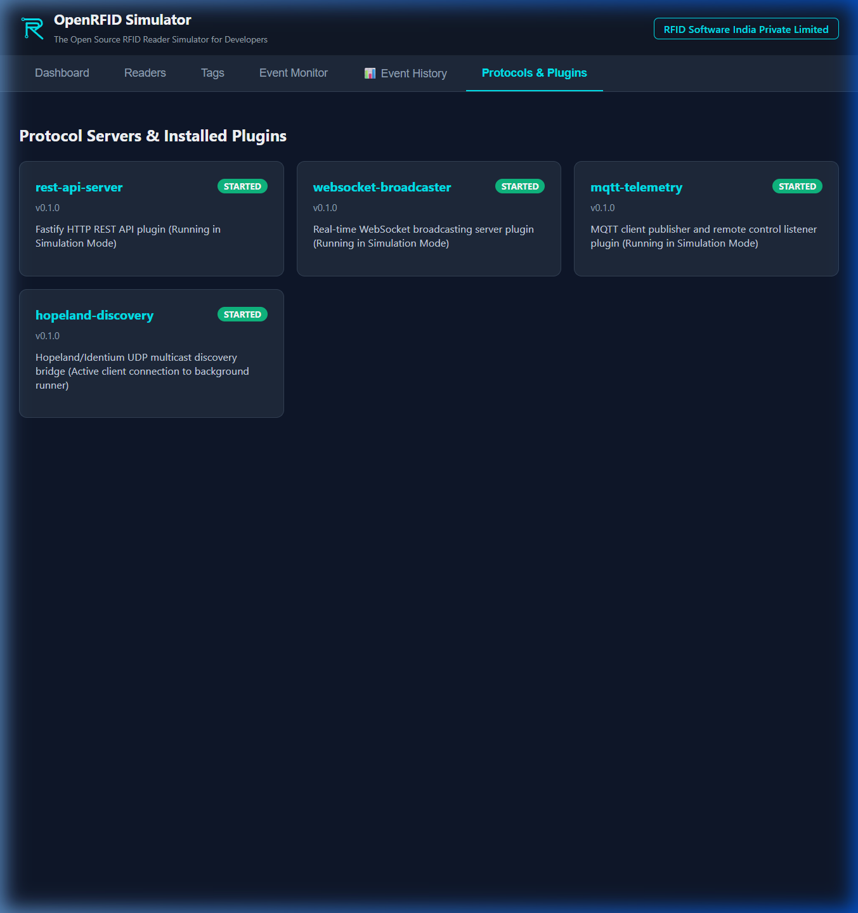

<div align="center">


# OpenRFID Simulator

### The Modular Open-Source RFID Reader & Tag Simulation Framework

[](https://opensource.org/licenses/MIT)
[](https://github.com/rfidsoftwares/openrfid-simulator)
[](https://nodejs.org)
[](https://github.com/rfidsoftwares/openrfid-simulator)
[](https://github.com/rfidsoftwares/openrfid-simulator/pulls)
[](https://rfidsoftwares.com)

**[Website](https://rfidsoftwares.com)** • **[📥 Downloads](./DOWNLOADS.md)** • **[Documentation](https://github.com/rfidsoftwares/openrfid-simulator/tree/main/apps/docs)** • **[Research Paper Draft](./research-paper/PAPER_DRAFT.md)** • **[User Guide](./USER_GUIDE.md)** • **[Desktop Guide](./DESKTOP_GUIDE.md)**

</div>

---

## 🚀 Overview

**OpenRFID Simulator** is a high-performance, open-source RFID simulation framework designed for full-stack IoT software testing, education, and protocol research. 

It allows software developers creating RFID-enabled enterprise applications—such as **Warehouse Management Systems (WMS)**, **Asset Trackers**, **Logistics Gateways**, and **Access Control Systems**—to develop, test, and run automated CI/CD integration tests without acquiring expensive physical RFID readers or tags.

### 🌟 Key Highlights

- **⚡ High-Throughput Engine**: Benchmark performance of **5,000+ tag reads/sec** powered by a decoupled simulation event loop and persistent SQLite WAL logging.
- **🏷️ Bit-Level EPC & GS1 Encoding**: Bi-directional bitwise conversion for **EPC Gen2 memory banks** (EPC, TID, Reserved, User) and **GS1 identifiers** (**SGTIN-96**, **GRAI-96**, **GIAI-96**).
- **🔌 Hot-Swappable Protocol Plugins**: Built-in support for **Fastify REST API**, **WebSocket real-time streaming**, **MQTT IoT Broker publishing**, and **Hopeland/Identium UDP Multicast Discovery & TCP Server**.
- **🖥️ Multi-Interface Access**:
  - **Headless CLI**: Run zero-dependency automated tests in CI/CD via `npx @openrfid/cli`.
  - **Web SPA Console**: Browser-based management dashboard running on Vite React.
  - **Native Desktop App**: Secure, cross-platform desktop installers powered by Tauri and Rust.
- **🎓 Academic & Research Ready**: Includes an academic research paper draft ([research-paper/PAPER_DRAFT.md](./research-paper/PAPER_DRAFT.md)) and structured 10-phase development roadmap.

---

## 📸 Interface Screenshots

### 1. Main Dashboard
*Real-time system health metrics, online reader counts, and active tag inventory throughput.*


### 2. Readers & Antenna Tuning Management
*Configure 1–16 antenna ports per reader with custom Tx Power (dBm), Gain (dBi), and RSSI offsets.*


### 3. Add Reader Configuration
*Add virtual readers with IP binding, command ports, and protocol modes (Hopeland, LLRP, Generic).*


### 4. Antenna Port Calibration
*Tuning antenna power levels (0–30 dBm) and read zones.*


### 5. Tag Batch Generator & Memory Inspector
*Generate bulk tag pools using Sequential Hex, Random Hex, or SGTIN-96 GS1 Barcodes.*


### 6. Live Event Monitor
*Real-time terminal scan feed streaming tag detections, RSSI logs, and antenna associations.*


### 7. Protocols & Plugin Manager
*Toggle and configure REST, WebSocket broadcast, and MQTT broker network plugins.*


---

## 📦 Packages in the Monorepo

| Package | Version | Description | Install Command |
| :--- | :---: | :--- | :--- |
| **[`@openrfid/core`](./packages/core)** | `0.1.0` | Core DI, EventBus, Config, & SQLite storage | `npm i @openrfid/core` |
| **[`@openrfid/epc`](./packages/epc)** | `0.1.0` | EPC Gen2 tag memory encoding/decoding | `npm i @openrfid/epc` |
| **[`@openrfid/gs1`](./packages/gs1)** | `0.1.0` | GS1 SGTIN-96, GRAI-96, GIAI-96 encoders | `npm i @openrfid/gs1` |
| **[`@openrfid/utils`](./packages/utils)** | `0.1.0` | Math distributions & helper utilities | `npm i @openrfid/utils` |
| **[`@openrfid/tags`](./packages/tags)** | `0.1.0` | RFID tag domain models & memory generator | `npm i @openrfid/tags` |
| **[`@openrfid/readers`](./packages/readers)** | `0.1.0` | Virtual reader & multi-antenna engine | `npm i @openrfid/readers` |
| **[`@openrfid/simulator`](./packages/simulator)** | `0.1.0` | High-performance inventory cycle simulator | `npm i @openrfid/simulator` |
| **[`@openrfid/plugin-api`](./packages/plugin-api)** | `0.1.0` | Plugin lifecycle interfaces & sandbox | `npm i @openrfid/plugin-api` |
| **[`@openrfid/rest`](./packages/rest)** | `0.1.0` | Fastify REST API plugin (`/readers`, `/tags`) | `npm i @openrfid/rest` |
| **[`@openrfid/websocket`](./packages/websocket)** | `0.1.0` | WebSocket real-time tag stream broadcaster | `npm i @openrfid/websocket` |
| **[`@openrfid/mqtt`](./packages/mqtt)** | `0.1.0` | MQTT client/broker telemetry plugin | `npm i @openrfid/mqtt` |
| **[`@openrfid/ui`](./packages/ui)** | `0.1.0` | Shared React component library | `npm i @openrfid/ui` |
| **[`@openrfid/cli`](./packages/cli)** | `0.1.0` | Headless CLI binary tool | `npm i -g @openrfid/cli` |

---

## ⚡ Quickstart

### 1. Instant Run via CLI (No Installation Required)

Launch a headless simulation instance directly using `npx`:

```bash
npx @openrfid/cli simulator start
```

### 2. Run Web Development Console Locally

```bash
# Clone repository
git clone https://github.com/rfidsoftwares/openrfid-simulator.git
cd openrfid-simulator

# Install dependencies using pnpm
pnpm install

# Start local dev server (Vite SPA & runner)
pnpm dev
```

Open `http://localhost:5173/` in your browser.

### 3. Run Unit Tests

```bash
pnpm test
```

### 4. Build Desktop Applications (Tauri)

```bash
pnpm build:desktop
```

---

## 🧪 Automated CI/CD Integration

To run OpenRFID Simulator inside GitHub Actions CI/CD to test your enterprise applications automatically:

```yaml
name: Integration Tests

on: [push, pull_request]

jobs:
  test:
    runs-on: ubuntu-latest
    steps:
      - uses: actions/checkout@v4
      - uses: actions/setup-node@v4
        with:
          node-version: 20
      
      # Launch headless RFID simulator in background
      - name: Start OpenRFID Simulator
        run: npx @openrfid/cli simulator start --detach
      
      # Run your app's integration tests against simulated REST/MQTT endpoints
      - name: Run App Tests
        run: npm test
```

---

## 📄 Academic Research Paper

If you use OpenRFID Simulator in your research, academic thesis, or paper, please cite our framework paper:

> **Title**: *A Modular Open-Source RFID Simulation Framework for Developer Testing, Education, and Protocol Research*  
> **Draft Path**: [`research-paper/PAPER_DRAFT.md`](./research-paper/PAPER_DRAFT.md)  
> **Authors**: OpenRFID Simulator Team (RFID Software India Private Limited)

```bibtex
@article{openrfid2026simulator,
  title={A Modular Open-Source RFID Simulation Framework for Developer Testing, Education, and Protocol Research},
  author={OpenRFID Simulator Engineering Team},
  journal={RFID Software India Private Limited},
  year={2026},
  url={https://github.com/rfidsoftwares/openrfid-simulator}
}
```

---

## 🗺️ Roadmap & Future Phases

- [x] **Phase 1**: Monorepo Foundation & Core Utility Libraries (`100%`)
- [x] **Phase 2**: Simulation Engine & Data Persistence (`100%`)
- [x] **Phase 3**: Plugin System & Baseline Protocol Plugins (`100%`)
- [x] **Phase 4**: Frontend UI Component Library & Desktop/Web Shell (`100%`)
- [x] **Phase 5**: CLI Tool, Documentation & v1.0 MVP Launch (`100%`)
- [ ] **Phase 6**: Advanced Protocols (LLRP v2+, Raw TCP/UDP, COM Serial) (`v2.0`)
- [ ] **Phase 7**: Visual Warehouse Spatial 2D/3D Floorplan Positioning (`v3.0`)
- [ ] **Phase 8**: RF Physics Engine (Friis Transmission, Slotted ALOHA) (`v4.0`)
- [ ] **Phase 9**: Cloud Ecosystem & LLM AI Scenario Generator (`v5.0`)

See [roadmap/tracker.txt](./roadmap/tracker.txt) for detailed task specifications.

---

## 📄 License & Corporate Support

This project is licensed under the **MIT License** — see the [LICENSE](./LICENSE) file for details.

Developed & Maintained by **RFID Software India Private Limited**.  
For enterprise RFID middleware, custom hardware drivers, or commercial integrations, visit **[rfidsoftwares.com](https://rfidsoftwares.com)**.
