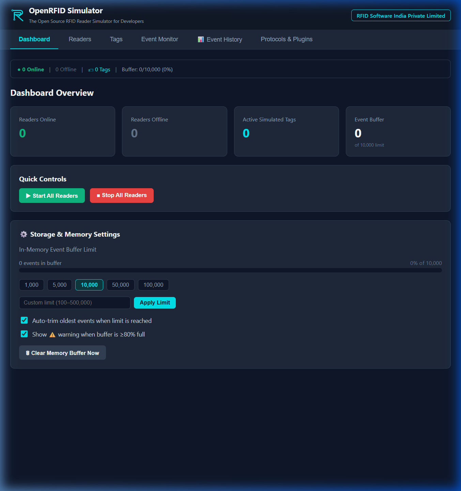
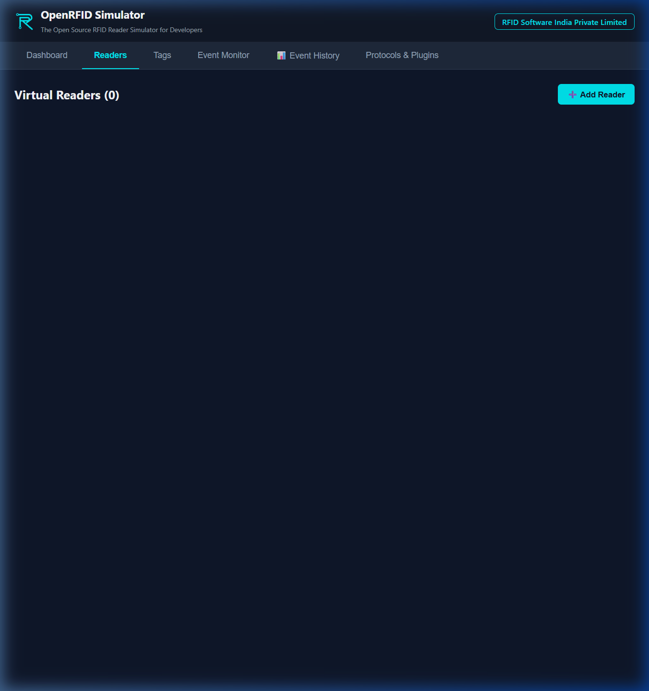
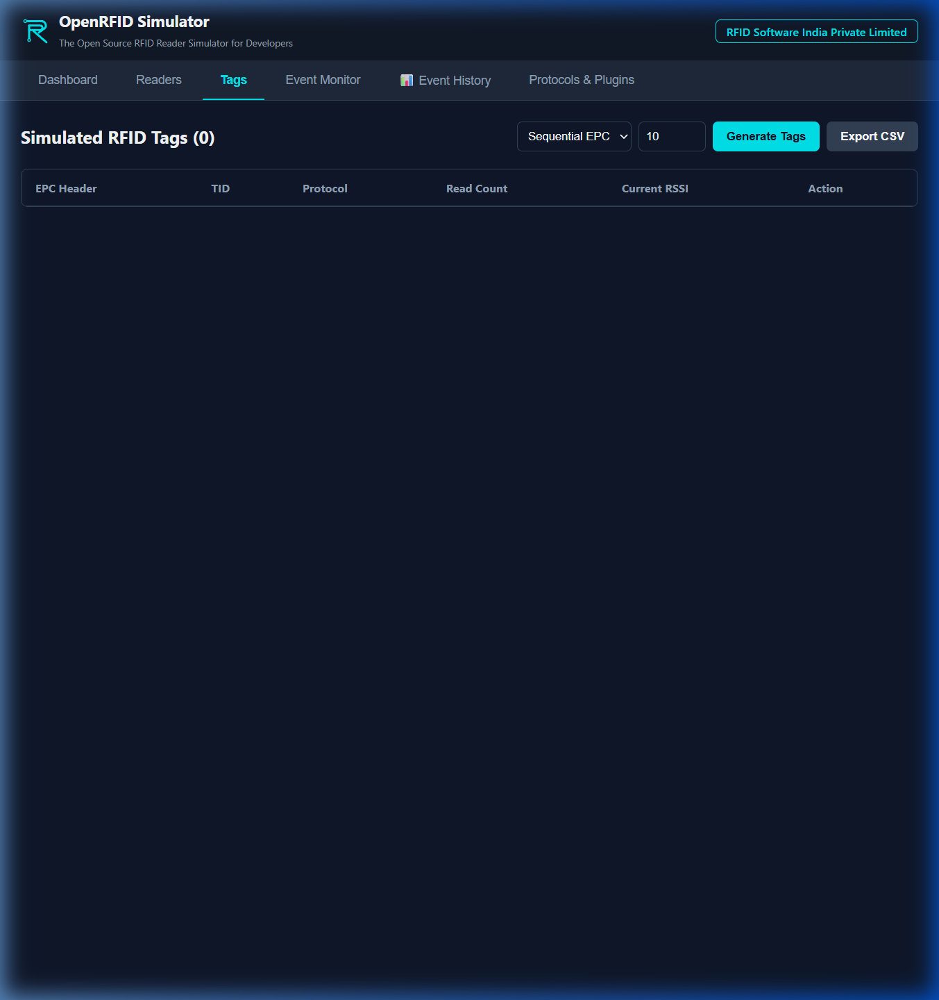
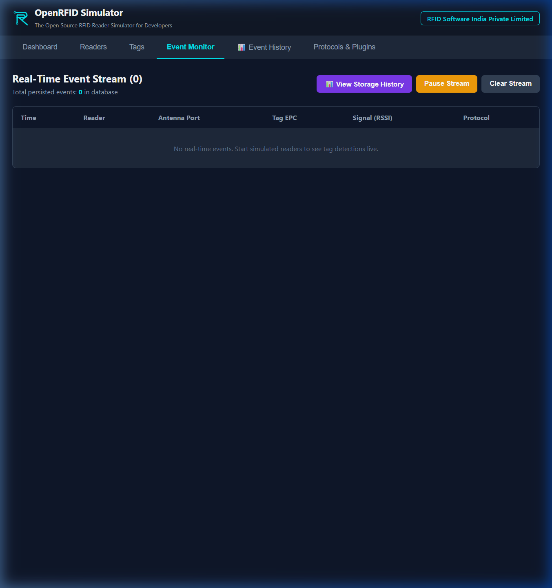

# OpenRFID Simulator Web Console User Guide
### The Open Source RFID Reader Simulator for Developers
**Brought to you by RFID Software India Private Limited** — [rfidsoftwares.com](https://rfidsoftwares.com)

---

## 1. Introduction

**OpenRFID Simulator** is a modular, developer-centric platform designed to simulate physical RFID hardware. It allows developers to build, test, and demonstrate RFID-enabled software applications (such as inventory, logistics, or asset-tracking systems) without requiring physical RFID readers and tag assets.



---

## 2. Key Features

* **Virtual Readers**: Define multiple virtual readers with custom configurations (IP, port, protocols, read mode, read interval, and active antennas).
* **Tag Simulation**: Generate and customize simulated tags with unique EPCs (Electronic Product Codes), TIDs (Tag Identifiers), RSSI (signal strength), and antenna associations.
* **Multi-Protocol Support**:
  * **REST API Server**: For HTTP-based reader configuration and control.
  * **WebSocket Broadcaster**: Stream real-time tag scan events directly to web and mobile apps.
  * **MQTT Client**: Publish telemetry events to cloud brokers (AWS, GCP, Azure, or local brokers).
  * **Hopeland/Identium UDP Discovery & TCP Server**: Auto-discoverable by official reader SDKs (MyReaderAPI).
* **Real-time Event Monitor**: Live terminal monitor for viewing tag scans, read cycles, and network operations.

---

## 3. Getting Started (Web Developer Version)

To run the simulator locally in web development mode:

1. **Install dependencies**:
   ```bash
   pnpm install
   ```
2. **Start the Developer Console & Runner**:
   ```bash
   pnpm dev
   ```
3. Open [http://localhost:5173/](http://localhost:5173/) in your web browser to access the control panel.

---

## 4. How to Use the Simulator (Step-by-Step)

### 4.1 Creating & Adding a Virtual Reader
1. Navigate to the **Readers** tab in the sidebar.
2. Click the **➕ Add Reader** button (or use the inline reader creation fields).
3. In the form, enter the following parameters:
   * **Reader Name**: A descriptive label for the hardware (e.g., `Warehouse Gate 1`).
   * **IP Address**: The network binding address for the simulated reader (defaults to `127.0.0.1` / localhost).
   * **Command Port**: The network port where the TCP/UDP server listens (e.g. `9090` for Hopeland protocol, `5084` for LLRP).
   * **Protocol**: Choose the protocol interface (e.g., `Hopeland` to connect with standard DLL SDKs/middleware, or `LLRP`).
   * **Vendor**: Manufacturer to simulate (e.g., `Hopeland`, `Impinj`, `Generic`).


4. Click **Confirm and Add** to register the device. It will appear on your list as an offline card.



### 4.2 Configuring Antenna Ports
Click the **Configure Ports** (or **Configure Reader**) button on the reader card to expand the antenna tuning panel. This screen allows you to simulate physical RF environment behaviors.


#### Antenna Parameters Explained:
* **Antenna Port Enable/Disable Switch**: Toggle individual antennas (Port 1 to 4). If disabled, the antenna will not transmit RF energy, and tags assigned to this antenna zone will not be scanned.
* **Power (dBm)**: Adjusts the RF power level (ranging from `0` to `30` dBm).
  * *High Power (25-30 dBm)*: Simulates long-range scanners (e.g., loading dock portals). Captures tags at high rates and reports strong RSSI signals.
  * *Low Power (<15 dBm)*: Simulates proximity scanners (e.g., desktop enrollment stations).
* **Gain (dBi)**: Adjusts the passive antenna gain. Higher gain values boost directional signal levels.
* **RSSI Offset**: Baseline offset added/subtracted from the final signal strength to simulate cable losses or custom RF attenuation.
* **Read Zone**: A descriptive physical zone identifier (e.g., `Zone A`, `Door 1`). Tags configured under this zone will only be picked up when this specific antenna port is active and scanning.

### 4.3 Starting and Stopping a Reader
* **To Start**: Click **▶ Start Simulation** on the reader card. The status badge will change from `OFFLINE` to `ONLINE`. When online, it opens its TCP/UDP ports and starts scanning tag inventory.
* **To Stop**: Click **⏹ Stop Simulation** to bring the reader offline and close all communication ports.

### 4.4 Simulating RFID Tags
1. Navigate to the **Tags** tab in the sidebar.
2. Select the generation mode in the dropdown:
   * **Sequential EPC**: Generates incrementing hex EPC codes.
   * **Random Hex**: Generates random hex codes.
   * **SGTIN-96 GS1**: Generates standard GS1-compliant retail barcodes.
3. Enter the number of tags to generate.
4. Click **Generate Tags**. The virtual tag list will populate.



#### RFID Tag Parameters:
* **EPC Header**: The Electronic Product Code unique ID.
* **TID**: Factory-locked unique silicon serial number (usually 8 bytes).
* **Protocol**: RFID protocol version (e.g., `GEN2`).
* **Read Count**: How many times this tag has been read by online readers.
* **Current RSSI**: Logged signal strength (e.g. `-51.9 dBm`).

### 4.5 Monitoring Scans & Events
Navigate to the **Event Monitor** tab to view the live terminal. You will see incoming tag detections with timestamps, Antenna IDs, reader ID, and RSSI logs.



---

## 5. Integrating with RFID Middleware (e.g., Hopeland/Identium)

The simulator natively implements the **Hopeland/Identium binary protocol**. 

### 5.1 Auto-Discovery via UDP Multicast
When the background runner is active, it automatically broadcasts reader information every 2 seconds to the multicast group **`230.1.1.116:9091`** in the following format:
```ascii
^RFID_READER_INFORMATION:OpenRFID-Sim,IP:192.168.1.5,MAC:52-46-XX-XX-XX-XX,PORT:9090,HOST_SERVER_IP:0.0.0.0,HOST_SERVER_PORT:0,MODE:SERVER,NET_STATE:CONNECTED$
```
Any middleware or SDK (such as `MyReaderAPI.dll`) listening on this multicast group will automatically discover the virtual reader.

### 5.2 TCP Command Server
Once discovered, the middleware connects to the simulator via TCP on port **`9090`**.
* The simulator accepts the connection and responds to commands (like `GetEPC` to start reading or `Stop` to pause).
* Tag detections are streamed to the middleware in raw binary frames.

### 5.3 Binary Packet Dissection
Here is an example of a raw hex packet forwarded to your middleware:
`AA 02 12 00 19 00 01 34 0C E2 00 00 00 00 00 00 00 00 00 00 01 08 E2 80 00 00 00 00 00 00 86 2D`

* **`AA`**: Frame Header (Start marker).
* **`02`**: Reader Address.
* **`12`**: Command type (`0x12` = Tag Data Notification).
* **`00 19`**: Data length (25 bytes).
* **`00`**: Result code (Success).
* **`01`**: Antenna Port #1.
* **`34`**: RSSI (`0x34` = 52 in decimal, representing absolute value of `-52 dBm`).
* **`0C`**: EPC length (12 bytes).
* **`E2 00 00 00 00 00 00 00 00 00 00 01`**: Tag EPC.
* **`08`**: TID length (8 bytes).
* **`E2 80 00 00 00 00 00 00`**: Tag TID.
* **`86 2D`**: CRC16 Checksum.

---

## 6. Code Protection & Licensing

The desktop application is built with security and integrity in mind:
* **MIT License**: The codebase is open-source. Full license details can be viewed in the [LICENSE](file:///f:/work/open%20library/open%20rfid%20simulator/LICENSE) file or on the installer setup screens.
* **Symbol Stripping**: Release builds are compiled with Link-Time Optimizations (LTO) and fully stripped of debug symbols to prevent easy decompilation.
* **Production UI Restrictions**: When running in production (installed setup), right-click context menus, "View Source" (`Ctrl+U`), and DevTools consoles (`F12`, `Ctrl+Shift+I`) are automatically disabled to keep the desktop client secure.

---
*For corporate licensing, hardware drivers, and enterprise RFID software custom integrations, visit [rfidsoftwares.com](https://rfidsoftwares.com).*
