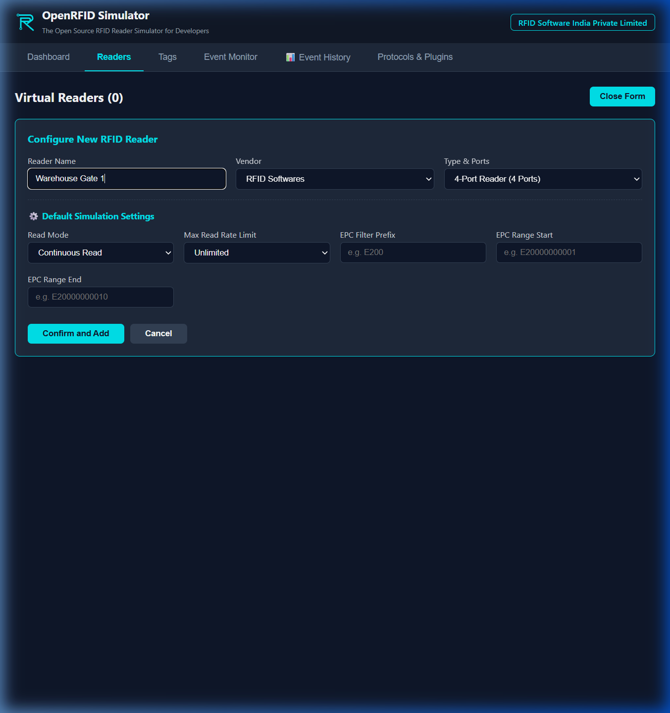
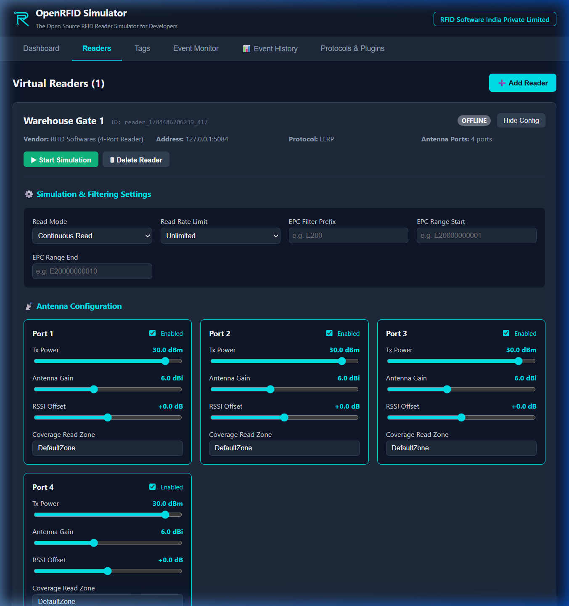

# Desktop App Guide

The native desktop client runs as a standalone Windows executable. It packages the React control panel together with the Node.js Hopeland network Discovery service (compiled as a secure binary sidecar).

## 1. Creating and Configuring Readers

1. Navigate to the **Readers** tab in the left sidebar.
2. Click the **➕ Add Reader** button to launch the reader registration panel.
3. Configure the parameters:
   * **Reader Name**: Label (e.g., `Warehouse Gate 1`).
   * **IP & Port**: Local bind address and port.
   * **Protocol**: e.g., `Hopeland`.

---

## 2. Tuning Antenna Ports

Click the **Configure Ports** button to expand the RF controls:

* **Antenna Toggles**: Turn Ports 1–4 ON/OFF.
* **Power (dBm)**: Set transmission power (from 0 to 30 dBm).
* **Gain (dBi)**: Set antenna gain.
* **RSSI Offset**: Baseline offset adjustment.
* **Read Zone**: Name spatial zones.

---

## 3. Starting/Stopping Simulation
* Click **▶ Start Simulation** to open the network servers and begin scanning.
* Click **⏹ Stop Simulation** to take the device offline.
